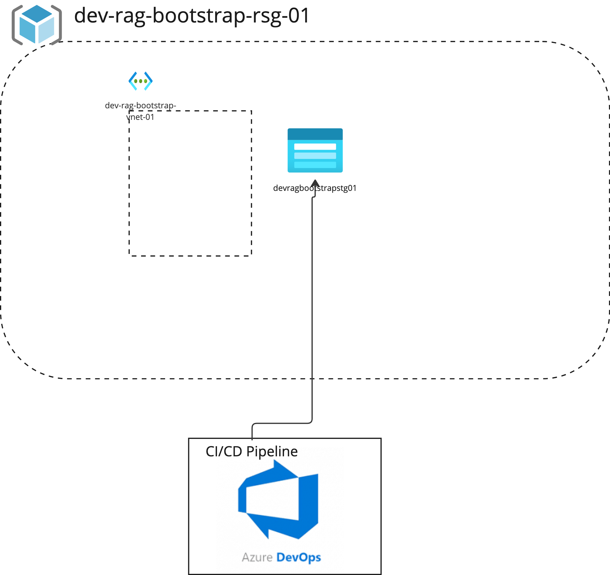
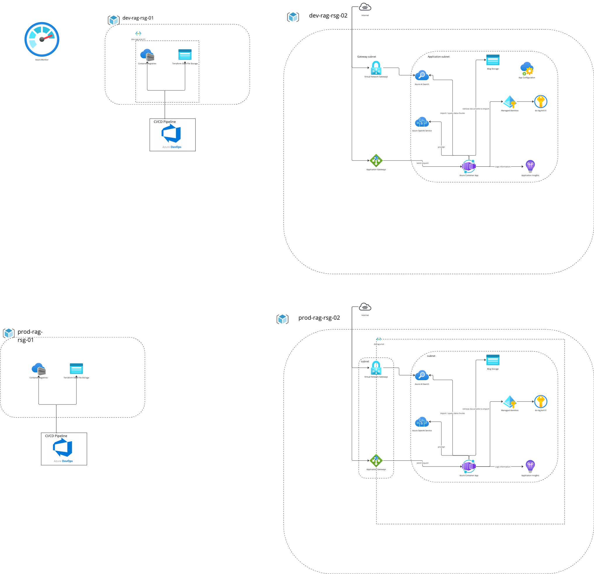

# Rag Terraform Infrastructure

## Overview

Each service will be in it's own terraform module. This is to encourage separate of concern and avoid having one big terraform module that contains everything and result in an messy codebase. To make changes to a service, make the necessary changes and run the terraform plan and apply command in the directory related to the service that you are change.

### Current Infrastructure



### Final Infrastructure



## Provisioning Azure Resources Using Terraform

Before you begin, ensure that you're logged into Azure by executing the `az login` command. Set your account to the correct subscription where you want to provision your resources using `az account set -s <subscription id>`.

### 1. Verify Necessary Bootstrap Resources

If this is your first time provisioning resources using Terraform and the following resources are missing:

```
resource_group - "rg-rag-bootstrap-dev-01"
storage_account - "ragbootstrapdev01"
container - "tfstate"
```

You have two options:

**Option 1**: Manually create the required resources directly in the Azure portal.

**Option 2**: Remove the following block of code in `infrastructure/development/bootstrap/providers.tf`:

```
  backend "azurerm" {
      resource_group_name  = "rg-rag-bootstrap-dev-01"
      storage_account_name = "ragbootstrapdev01"
      container_name       = "tfstate"
      key                  = "terraform-bootstrap.tfstate"
  }
```

By removing the `backend "azurerm"` code block, you're storing the Terraform state file locally instead of in Azure Blob Storage. This step is necessary because the blob storage used to store the Terraform state file remotely hasn't been provisioned yet.

### 2. Initialize Terraform

Execute the `terraform init` command to download the necessary Terraform modules and providers.

### 3. Execute and Verify Terraform Plan

Run the `terraform plan` or `terraform plan -var-file="<replace-with-your-variable-file>.tfvars" -out main.tfplan` command in the directory where you've made changes. This command generates an execution plan and saves it to a file named `main.tfplan`. Review the changes Terraform will make to your infrastructure before applying them.

### 4. Apply Terraform Plan and Provision Resources

Execute the `terraform apply main.tfplan` command to apply the changes outlined in your execution plan. Verify that the changes have been successfully implemented in your Azure resources after this step. Always review the output of `terraform plan` to ensure the changes align with your intentions before running `terraform apply`.

### 5. Move Terraform State File to Azure Blob Storage (if you chose Option 2 in Step 1)

Revert the deleted `backend "azurerm"` block and rerun `terraform init`. This will allow Terraform to save the state file to Azure Blob Storage.

## How to make changes in Terraform?

1. **Modify the Terraform Configuration**: Make the necessary modifications to your Terraform configuration files to add, modify, or delete resources as required.

2. **Run the Terraform Plan**: Execute the command `terraform plan` or `terraform plan -var-file="<replace-with-your-variable-file>.tfvars" -out main.tfplan` in the directory where you've made changes. This command generates an execution plan and saves it to a file named `main.tfplan`. This step allows you to review the changes Terraform will make to your infrastructure before applying them.

   If you're using a variable file, replace `<replace-with-your-variable-file>` with the name of your `.tfvars` file. This file should contain the values for any variables your configuration uses.

3. **Apply the Terraform Plan**: Run the command `terraform apply main.tfplan` to apply the changes outlined in your execution plan. After this step, verify that the changes have been successfully implemented in your Azure resources.

Remember to always review the output of `terraform plan` carefully to ensure the changes align with your intentions before running `terraform apply`. This can help prevent unintended modifications to your infrastructure.

## Code folder structure

- [**development**](development)
  - [**bootstrap**](development/bootstrap)
  - [**services**](development/services)
    - [**ai-search**](development/services/ai-search)
- [**modules**](modules)
  - [**container-registry**](modules/container-registry)
  - [**key-vault**](modules/key-vault)
  - [**resource-group**](modules/resource-group)
  - [**user-assigned-identity**](modules/user-assigned-identity)
- [**production**](production)

### development

This folder will contain all the development environment resources.

#### development/bootstrap

This folder will contain all the terraform configurations to setup the basic resources that we will need before setting up other services.

### modules

This folder contains all the terraform modules that we have setup so that we can reuse them in both the development and production infrastructure setup.

The terraform modules also enable us to bootstap some of the details when setting up resources. You can treat the modules as the basic building blocks that will be used by other modules to build up a complete service.

### production

This folder will contain all the production environment resources.

## Resource naming convention

We will be following the resource naming convention as recommended by Microsoft in the following link: [Azure resource naming convention best practice](https://learn.microsoft.com/en-us/azure/cloud-adoption-framework/ready/azure-best-practices/resource-naming)

In general, this is the format that we should follow:

| Naming Component                          | Description                                                                                                                                                                                                                                                       |
| ----------------------------------------- | ----------------------------------------------------------------------------------------------------------------------------------------------------------------------------------------------------------------------------------------------------------------- |
| **Organization**                          | Top-level name of the organization, normally utilized as the top management group or, in smaller organizations, part of the naming convention. Example: contoso                                                                                                   |
| **Business Unit or Department**           | Top-level division of your company that owns the subscription or the workload that the resource belongs to. In smaller organizations, this component might represent a single corporate, top-level organizational element. Examples: fin, mktg, product, it, corp |
| **Resource Type**                         | An abbreviation that represents the type of Azure resource or asset. This component is often a prefix or suffix in the name. For more information, see Recommended abbreviations for Azure resource types. Examples: rg, vm                                       |
| **Project, Application, or Service Name** | Name of a project, application, or service that the resource is a part of. Examples: navigator, emissions, sharepoint, hadoop                                                                                                                                     |
| **Environment**                           | The stage of the development lifecycle for the workload that the resource supports. Examples: prod, dev, qa, stage, test                                                                                                                                          |
| **Location**                              | The region or cloud provider where the resource is deployed. Examples: westus, eastus2, westeu, usva, ustx                                                                                                                                                        |
| **VM Role**                               | Identifier of the purpose of the VM. Examples: db (database), ws (web server), ps (print server)                                                                                                                                                                  |
| **Instance**                              | The instance count for a specific resource, to differentiate it from other resources that have the same naming convention and naming components. Examples, 01, 001                                                                                                |

Format: `<resource-type>-<project-name>-<environment>-<location>-<vm-role><instance>`

Example: `rg-rag-bootstrap-dev-01`
